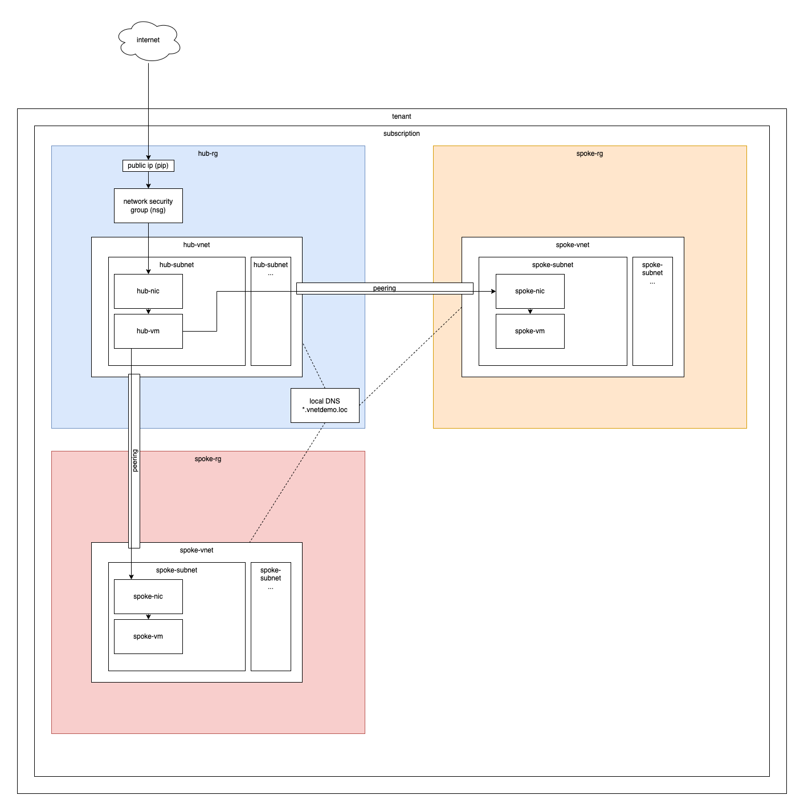

# Azure vnets with terraform


I explain an hub-spoke vnet architecture deployed to Microsoft Azure with Terraform. By the way, why is this called hub-spoke architecture? That's why ... some say, it should look like a wheel.


## Referenced documentation

[1] [Hub-and-spoke network topology](https://docs.microsoft.com/en-us/azure/cloud-adoption-framework/ready/azure-best-practices/hub-spoke-network-topology): Microsoft Docs, January 20th, 2022

[2] [Create a spoke network in Azure using Terraform](https://docs.microsoft.com/en-us/azure/developer/terraform/hub-spoke-spoke-network):  Microsoft Docs, January 20th, 2022

[3] [Create a hub and spoke hybrid network topology in Azure using Terraform](https://docs.microsoft.com/en-us/azure/developer/terraform/hub-spoke-introduction):  Microsoft Docs, January 20th, 2022

[4] [Validate a hub and spoke network in Azure using Terraform](https://docs.microsoft.com/en-us/azure/developer/terraform/hub-spoke-validation): Microsoft Docs, January 20th, 2022

[5] [Terraform quickstart guide](https://github.com/JamborJan/terraform-guide): Jan Jambor, January 20th, 2022

## Setting up terraform

If you have Terraform not yet up and running, you can follow along with my small quick start guide [[5](https://github.com/JamborJan/terraform-guide)].

## Quick intro why we do this

The Microsoft documentation about [Hub-and-spoke network topology [1]](https://docs.microsoft.com/en-us/azure/cloud-adoption-framework/ready/azure-best-practices/hub-spoke-network-topology) describes most of the things why this is done quite well. Summarized these aspects are important:

- You'll want one single point of entry into the network, this is your hub vnet
- Centralize network administration and security measures in the hub
- Separate workloads into the spokes

## Explanation of the example

Azure vnets and resources can be spread over tenants and/or different subscriptions. In such a case multiple service principles might be necessary to create the resources. For the sake of reducing complexity in this example, I'm using only one tenant and one subscription and thus only one service principal. Service principals might also be limited to certain resource groups in that case you would also need more than one to create resources.

The picture below shows a graphical interpretation of what the Terraform code is creating. Some things, like the network security group, are placed to make sense in a human logical way but are actually connected to subnets of vnets.



The different terraform files are inside the `terraform` subfolder of this repo and are:

### `azure.conf`

Secret management is done as I described it [here [5]](https://github.com/JamborJan/terraform-guide#working-with-secrets) either in a local `azure.conf` or in variable groups which can be used in pipelines. So for testing locally you would need an `azure.conf` file.

Hint: ensure the container mentioned in the backend configuration is created in the Azure storage.

### `workspacetest.sh`

This script will be used to switch between workspaces which are used as stages e.g. development (DEV), test (TST), and production (PRD).

### `backend.tf`

I'm storing the state of my infrastructure in general in Azure storage. You could also define local storage here if you are testing things and do not share the state with other developers.

### `provider.tf`

The Azure Resource Manager [azurerm](https://registry.terraform.io/providers/hashicorp/azurerm/latest) will be used as a provider to create resources.

### `variables.tf`

This file contains everything which can be adjusted. There are some general variables like Azure region and resource group names, specific variables like in our case vnet names, and also tags I'm using to organize resources.

### `terraform.tfvars`

This is a special file where you can put the content of variables you are specifying in `variables.tf`. Make sure to never commit this file to a repo. I'm using this here for example to store my public ssh key I want to use for the connection to the created VMs.

### `main.tf`

In this file, the magic happens. The following resources are created for the hub zone and the spokes. I implemented a counter that you can set in the `variables.tf` to decide how many spokes you want to have. That's rather for fun and to show how counters work, as it makes no sense in actual environments.

For each zone these resources are generated:
- `azurerm_resource_group`: a resource group for all resources of each zone
- `azurerm_virtual_network`: the virtual network (vnet) for each zone
- `azurerm_private_dns_zone_virtual_network_link`: a link from the vnet to the private DNS to enable name resolution across vnets
- `azurerm_subnet`: the subnet where resource are placed in
- `azurerm_network_interface`: network interfaces we need in our example because we are using VMs as simulated workloads
- `azurerm_linux_virtual_machine`: some tiny Linux VMs to test and simulate network connections
- `azurerm_private_dns_a_record`: a DNS record will be set for every VM to allow name resolution for it
- `azurerm_virtual_network_peering`: network peering from each spoke to the hub and vice versa, ensure to have both directions

Further, these things are created:
- `azurerm_public_ip`: which is connected to the NIC of the hub-zone vm
- `azurerm_network_security_group`: which is connected to the hub-zone subnet, we only need that in the hub zone in our example to limit public access to tcp port 22 and a whitelist of IP addresses
- `azurerm_subnet_network_security_group_association`: the connection between nsg and subnet of the hub-zone
- `azurerm_private_dns_zone`: a private DNS to allow name resolution across peered vnets

### `output.tf`

This contains the output terraform is returning when done. We don't need anything here as we can look up the results in the Azure portal. but you could for example print out the new public IP used for the hub zone.

## Executing terraform to create the resources

```
terraform init -backend-config=azure.conf
./workspacetest.sh DEV
terraform plan -out out.plan
terraform plan -destroy -out out.plan
terraform apply out.plan
```

## Test the result

You can now:
- ssh into the VM in the hub zone only from whitelisted IP addresses
- go on to any of the VMs in the spoke zones with IP addresses or FQDN
- resolve the name of any vm, also between spoke zones
- but you cannot connect between spokes directly, e.g. ssh from spoke 1 to spoke 2
